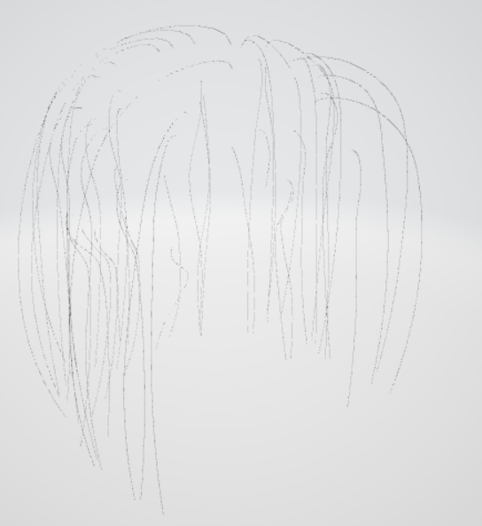

## Pbrt2Obj
---
It only gets the 4 control points of pbrt file(curve please)...and it's fake...Because I only trying to draw the lines between points,and make it thicker,actually it's just a square.....

I write this code,because I only wanna change the position of the curves in maya..

I took 1000 of [straight-hair](https://github.com/mmp/pbrt-v4-scenes/tree/master/hair/geometry)..(the whole file is to big)

and get the .obj as follow:

render all of [straight-hair](https://github.com/mmp/pbrt-v4-scenes/tree/master/hair/geometry)!

